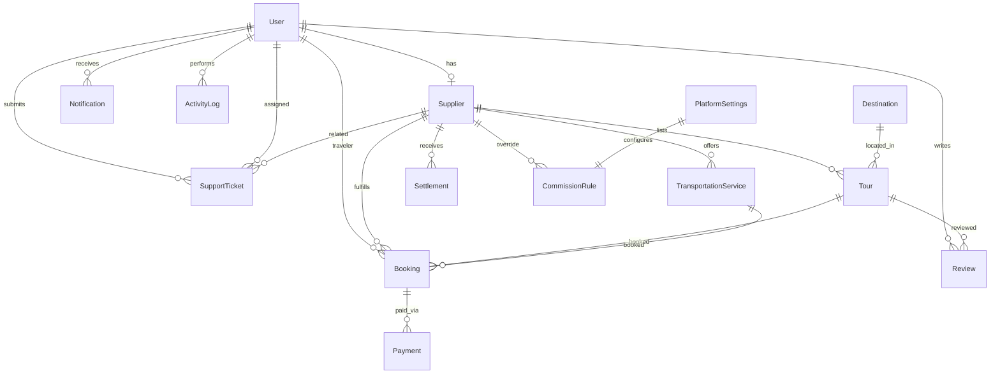

# My Fiji Tour — Marketplace Architecture

Production-ready travel marketplace: PostgreSQL + Prisma + Next.js App Router + Clerk + Stripe.

---

## 1. Entity Relationship Diagram



### Core relationships

| Parent | Child | Cardinality | On delete |
|--------|-------|-------------|-----------|
| User | Supplier | 1:1 | Cascade |
| User | Booking (traveler) | 1:N | Restrict |
| Supplier | Tour | 1:N | Restrict |
| Supplier | TransportationService | 1:N | Restrict |
| Destination | Tour | 1:N | Restrict |
| Booking | Payment | 1:N | Restrict |
| Supplier | Settlement | 1:N | Restrict |
| User + Tour | Review | N:1 | Cascade (unique per user/tour) |

---

## 2. Database tables (13 core + platform)

| # | Table | Purpose |
|---|-------|---------|
| 1 | `users` | Travelers, suppliers, admins (Clerk-synced) |
| 2 | `suppliers` | Operator profiles linked to users |
| 3 | `destinations` | Fiji regions (Nadi, Denarau, Coral Coast, etc.) |
| 4 | `tours` | Experiences listed by suppliers |
| 5 | `transportation_services` | Transfers and drivers |
| 6 | `bookings` | Marketplace transactions |
| 7 | `payments` | Stripe payment intents |
| 8 | `settlements` | Supplier payout invoices |
| 9 | `reviews` | Tour moderation queue |
| 10 | `travel_guides` | CMS editorial content |
| 11 | `faqs` | Support knowledge base |
| 12 | `notifications` | In-app alerts |
| 13 | `activity_logs` | Audit trail |
| + | `platform_settings` | Global config |
| + | `commission_rules` | Tiered commission |
| + | `banners` / `homepage_sections` | CMS |
| + | `support_tickets` | Support center |
| + | `analytics_snapshots` | GA / Clarity / internal metrics |
| + | `enquiries` | Concierge form (migrated from file store) |

Schema: [`prisma/schema.prisma`](../prisma/schema.prisma)

---

## 3. API architecture

### Versioning

All marketplace APIs live under `/api/v1/`.

### Admin API (`/api/v1/admin/*`)

| Method | Route | Permission | Action |
|--------|-------|------------|--------|
| GET | `/dashboard` | `dashboard:read` | KPIs + charts |
| GET | `/analytics` | `analytics:read` | Extended analytics |
| GET | `/bookings` | `bookings:read` | List bookings |
| GET/PATCH | `/bookings/[id]` | `bookings:read/write` | View, edit, cancel, refund |
| GET/PATCH | `/suppliers` | `suppliers:read/approve` | List, approve, suspend |
| GET/PATCH | `/tours` | `tours:read/approve` | List, approve, feature, archive |
| GET/PATCH | `/transport` | `transport:read/approve` | Transportation CRUD |
| GET/PATCH | `/users` | `users:read/write` | User management |
| GET | `/payments` | `payments:read` | Stripe transactions |
| GET/PATCH | `/settlements` | `settlements:read/pay` | Payouts |
| GET/PATCH | `/settings` | `settings:read/write` | Platform + commission |
| GET/PATCH | `/reviews` | `reviews:moderate` | Review queue |
| GET | `/support` | `support:read` | Tickets |
| GET | `/notifications` | `notifications:read` | Admin notifications |

### Public API (planned `/api/v1/public/*`)

| Route | Purpose |
|-------|---------|
| `GET /destinations` | Published destinations |
| `GET /tours` | Search + filter tours |
| `POST /bookings` | Create booking (Clerk auth) |
| `POST /webhooks/stripe` | Payment events |
| `POST /webhooks/clerk` | User sync |

### Auth flow

1. **Clerk** — primary auth for travelers/suppliers/admins
2. **Legacy admin key** — `Authorization: Bearer <ADMIN_KEY>` during migration
3. **Permission guard** — `apiHandler(handler, permission)` enforces RBAC

### Response envelope

```json
{ "ok": true, "data": { ... } }
{ "ok": false, "error": "...", "code": "VALIDATION_ERROR" }
```

---

## 4. Admin dashboard architecture

```
┌─────────────────────────────────────────────────────────────┐
│  AdminShell (layout)                                          │
│  ├── Sidebar navigation (RBAC-filtered)                     │
│  ├── Theme toggle + refresh                                 │
│  └── AdminProvider → /api/v1/admin/*                        │
├─────────────────────────────────────────────────────────────┤
│  Page modules (client components)                           │
│  ├── Dashboard    → GET /api/v1/admin/dashboard           │
│  ├── Analytics    → GET /api/v1/admin/analytics           │
│  ├── Bookings     → GET/PATCH /api/v1/admin/bookings      │
│  ├── Suppliers    → GET/PATCH /api/v1/admin/suppliers      │
│  ├── Tours        → GET/PATCH /api/v1/admin/tours          │
│  ├── Transport    → GET/PATCH /api/v1/admin/transport      │
│  ├── Users        → GET/PATCH /api/v1/admin/users          │
│  ├── Payments     → GET /api/v1/admin/payments              │
│  ├── Settlements  → GET/PATCH /api/v1/admin/settlements    │
│  ├── Commission   → GET/PATCH /api/v1/admin/settings       │
│  ├── Content      → destinations, guides, FAQs, banners    │
│  ├── Reviews      → GET/PATCH /api/v1/admin/reviews        │
│  ├── Support      → GET /api/v1/admin/support              │
│  └── Settings     → GET/PATCH /api/v1/admin/settings       │
└─────────────────────────────────────────────────────────────┘
```

### Server layer

```
src/server/
├── api/handler.ts          # Route wrapper, error envelope, RBAC
├── auth/context.ts         # Clerk + legacy admin resolution
├── errors.ts               # Typed HTTP errors
└── services/
    ├── dashboard.service.ts
    ├── marketplace.service.ts
    └── activity-log.service.ts
```

---

## 5. Folder structure

```
prisma/
  schema.prisma
  seed.ts
  migrations/

src/
  app/
    api/
      v1/
        admin/           # Admin marketplace APIs
        public/          # Public marketplace APIs (phase 2)
        webhooks/
          stripe/
          clerk/
    admin/               # Admin UI pages
      page.tsx
      analytics/
      bookings/
      suppliers/
      tours/
      transport/
      users/
      payments/
      revenue/
      settlements/
      commission/
      content/
      reviews/
      support/
      settings/
      notifications/
      login/

  lib/
    db/prisma.ts
    auth/roles.ts
    auth/permissions.ts
    validations/admin.ts

  server/
    api/handler.ts
    auth/context.ts
    errors.ts
    services/

  components/
    admin/               # Existing UI shell + modules
```

---

## 6. Role permissions

| Permission | Traveler | Supplier | Admin |
|------------|:--------:|:--------:|:-----:|
| dashboard:read | | ✓ | ✓ |
| analytics:read | | | ✓ |
| bookings:read | ✓ | ✓ | ✓ |
| bookings:write/cancel/refund | | | ✓ |
| suppliers:* | | | ✓ |
| tours:read | | ✓ | ✓ |
| tours:write/approve/feature | | ✓* | ✓ |
| transport:* | | ✓* | ✓ |
| users:* | | | ✓ |
| payments:* | | | ✓ |
| settlements:read | | ✓ | ✓ |
| settlements:pay | | | ✓ |
| commission:* | | | ✓ |
| content:* | | | ✓ |
| reviews:moderate | | | ✓ |
| support:* | ✓ | ✓ | ✓ |
| settings:* | | | ✓ |

\* Suppliers scoped to own records via service-layer filters (phase 2).

Defined in [`src/lib/auth/permissions.ts`](../src/lib/auth/permissions.ts).

---

## 7. Next.js route structure

### Public routes
```
/                    Home
/login               Traveler auth (Clerk)
/signup              Registration
/places-to-go        Destinations (from DB)
/things-to-do        Tours (from DB)
/search              Search results
/contact             Concierge
```

### Admin routes
```
/admin/login         Enterprise admin login
/admin               Dashboard
/admin/analytics
/admin/bookings
/admin/suppliers
/admin/tours
/admin/transport
/admin/users
/admin/payments
/admin/revenue
/admin/settlements
/admin/commission
/admin/content
/admin/reviews
/admin/support
/admin/settings
/admin/notifications
```

---

## 8. Third-party integrations

| Service | Purpose | Env vars |
|---------|---------|----------|
| **Clerk** | Auth, SSO, user sync | `NEXT_PUBLIC_CLERK_PUBLISHABLE_KEY`, `CLERK_SECRET_KEY`, `CLERK_WEBHOOK_SECRET` |
| **Stripe** | Payments, Connect payouts | `STRIPE_SECRET_KEY`, `STRIPE_WEBHOOK_SECRET`, `NEXT_PUBLIC_STRIPE_PUBLISHABLE_KEY` |
| **PostgreSQL** | Primary database | `DATABASE_URL` |
| **Cloudinary** | Image CDN | `CLOUDINARY_CLOUD_NAME`, `CLOUDINARY_API_KEY`, `CLOUDINARY_API_SECRET` |
| **Resend** | Transactional email | `RESEND_API_KEY`, `EMAIL_FROM` |
| **Google Analytics** | Traffic | `GOOGLE_ANALYTICS_ID` (also in platform_settings) |
| **Microsoft Clarity** | Session replay | `MICROSOFT_CLARITY_ID` |
| **Search Console** | SEO | `SEARCH_CONSOLE_PROPERTY` |

---

## 9. Production implementation plan

### Phase 1 — Foundation (Week 1–2) ✅ Started
- [x] Prisma schema + migrations
- [x] DB client + seed (Fiji destinations)
- [x] RBAC permissions model
- [x] Admin API v1 routes
- [x] Activity logging service
- [ ] Run `prisma migrate dev` on staging PostgreSQL
- [ ] Wire admin UI pages to API (replace mock-data)

### Phase 2 — Auth & payments (Week 3–4)
- [ ] Clerk middleware + webhook user sync
- [ ] Map Clerk roles → `User.role`
- [ ] Stripe Checkout for bookings
- [ ] Stripe Connect for supplier payouts
- [ ] Webhook handlers (`payment_intent.succeeded`, `charge.refunded`)
- [ ] Commission calculation on booking create

### Phase 3 — Supplier portal (Week 5–6)
- [ ] `/supplier` dashboard (scoped queries)
- [ ] Tour + transport submission flows
- [ ] Settlement generation cron job
- [ ] Invoice PDF generation

### Phase 4 — Content & analytics (Week 7–8)
- [ ] CMS admin for guides, FAQs, banners
- [ ] Cloudinary upload pipeline
- [ ] GA4 + Clarity nightly sync → `analytics_snapshots`
- [ ] Conversion rate computation

### Phase 5 — Support & hardening (Week 9–10)
- [ ] Support ticket workflow + Resend notifications
- [ ] Review moderation + rating aggregation
- [ ] Rate limiting on public APIs
- [ ] Audit log retention policy
- [ ] E2E tests for booking + admin flows

---

## 10. Commands

```bash
# Install dependencies
npm install

# Generate Prisma client
npm run db:generate

# Create migration (requires DATABASE_URL)
npm run db:migrate

# Seed Fiji destinations + platform settings
npm run db:seed

# Open Prisma Studio
npm run db:studio
```

---

## 11. Security checklist

- [ ] All admin routes behind Clerk + RBAC
- [ ] Stripe webhooks signature-verified
- [ ] Clerk webhooks signature-verified
- [ ] `passwordHash` only for legacy; Clerk handles credentials
- [ ] Supplier data scoped by `supplierId` in service layer
- [ ] Activity logs on all mutating admin actions
- [ ] PII encrypted at rest (PostgreSQL provider)
- [ ] Rate limit `/api/v1/public/*`
